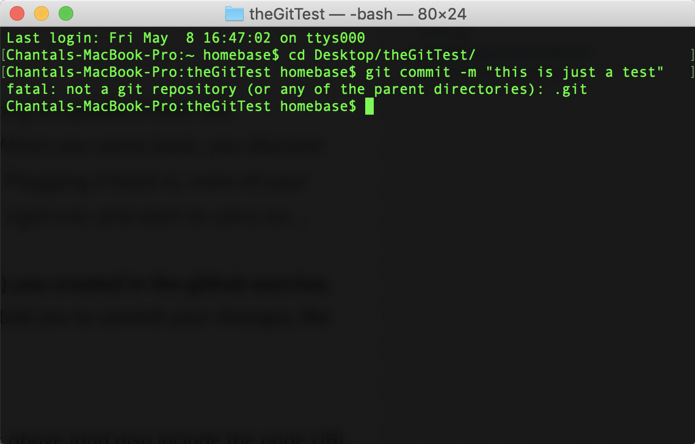

# The Demo Help Request

I was working on a project yesterday, left it, and came back to my work today and finished the project. I went to go commit my changes to the repository, entering ```git commit -m "this is just a test”```, and instead of the repository updating, I received the following error:
```fatal: not a git repository (or any of the parent directories): .git```
What does this mean? I am unsure of how to go about searching for a solution and would appreciate guidance. Perhaps I did not initialize the repository correctly, so is there a resource that you could direct me to that explains how to do this?

Screenshot of my terminal/error:


